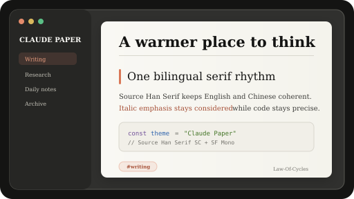
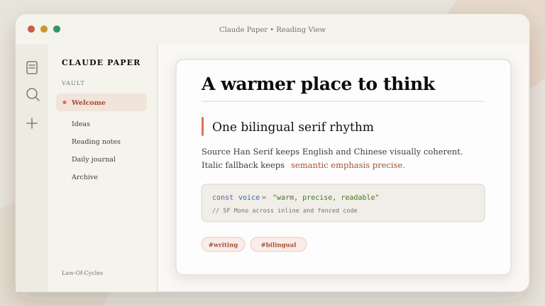
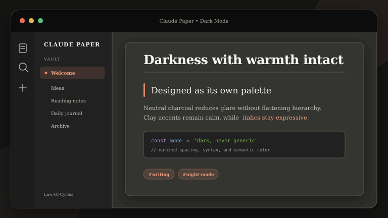
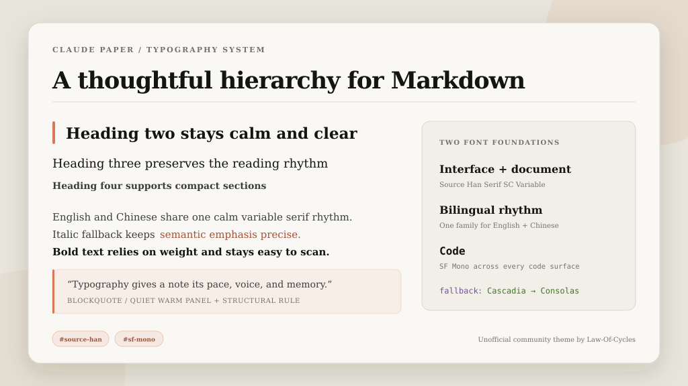

# Claude Paper

An unofficial Obsidian theme inspired by Claude and Anthropic's warm, thoughtful visual language. It combines clay accents, quiet paper-like surfaces, unified bilingual serif typography, precise monospaced code, and matched light and dark modes.

> Claude Paper is an independent community project by Law-Of-Cycles. It is not affiliated with, endorsed by, or sponsored by Anthropic. Claude and Anthropic are trademarks of Anthropic PBC. No Anthropic artwork or commercial font files are included.

[简体中文说明](README.zh-CN.md)



## Preview

| Light mode | Dark mode |
| --- | --- |
|  |  |



## Highlights

- Source Han Serif SC Variable across the interface, headings, editor, and reading view
- SF Mono across every inline and fenced code surface
- Resilient aliases for the `SourceHanSerifSC-VF` filename and registered family names
- Six clearly differentiated heading levels in Reading View and Live Preview
- Calm bold, italics, highlights, links, tags, quotes, lists, tasks, tables, callouts, footnotes, and properties
- Warm light mode and purpose-built dark mode using the same visual hierarchy
- Polished tabs, navigation, controls, settings, search, graph, Canvas, embeds, and code blocks
- Keyboard focus, increased-contrast, reduced-motion, small-screen, and print support
- Pure CSS with no telemetry, network requests, scripts, or bundled font files

## Typography

Claude Paper intentionally uses the two locally installed fonts requested for this project. Regular interface and document text stay in one bilingual family, which avoids visible font changes between Chinese and English. Code stays monospaced and visually separate.

| Role | Preferred order |
| --- | --- |
| Interface, headings, and body | `SourceHanSerifSC-VF` aliases, Source Han Serif SC, Source Han Serif, 思源宋体 |
| Code | SF Mono, SFMono-Regular, Cascadia Mono, Cascadia Code, Consolas |
| True English italic fallback | Source Serif 4, Source Serif Pro, Georgia, Times New Roman |

The theme sets `--font-interface-theme`, `--font-text-theme`, and `--font-monospace-theme`, so font choices made in Obsidian's Appearance settings still take priority. No font files are bundled or downloaded. See [Font strategy](docs/FONTS.md) for the exact aliases and troubleshooting.

## Install in Obsidian

### One-click local install on Windows

1. Extract the project ZIP.
2. Double-click `install.cmd`.
3. Select your vault folder when prompted, then choose **Claude Paper** in Obsidian under **Settings → Appearance → Themes**.

The completion dialog also reports whether Windows detected Source Han Serif SC and SF Mono.

You can also run:

```powershell
powershell -ExecutionPolicy Bypass -File .\install.ps1
```

### Manual install

Create this folder inside your vault and copy `manifest.json` and `theme.css` into it:

```text
<your-vault>/.obsidian/themes/Claude Paper/
```

Restart Obsidian or use **Reload app without saving**, then select **Claude Paper**.

## Publish to the Obsidian community directory

Double-click `publish.cmd`. The Windows publishing assistant reads the current version from `manifest.json`, pushes the project, creates or refreshes the matching release, and opens the Obsidian community review pull request when needed.

```powershell
powershell -ExecutionPolicy Bypass -File .\publish.ps1
```

If GitHub CLI is not signed in, the script opens GitHub once for browser authorization. The detailed fallback procedure is in [PUBLISH.md](PUBLISH.md).

## Customize

The main editable values are at the top of `theme.css`:

```css
:root {
  --claude-paper-font-serif: ...;
  --claude-paper-font-code: ...;
  --claude-paper-content-width: 780px;
}
```

Color and component decisions are documented in the [style guide](docs/STYLE-GUIDE.md).

## Project files

- `theme.css`: the complete Obsidian theme
- `manifest.json`: community theme metadata
- `screenshot.png`: 512 × 288 community directory image
- `install.cmd` and `install.ps1`: local Windows installer
- `publish.cmd` and `publish.ps1`: GitHub and Obsidian submission assistant
- `docs/`: typography, style notes, and additional previews
- `.github/workflows/release.yml`: release asset verification and upload

## License

[MIT](LICENSE) © Law-Of-Cycles
